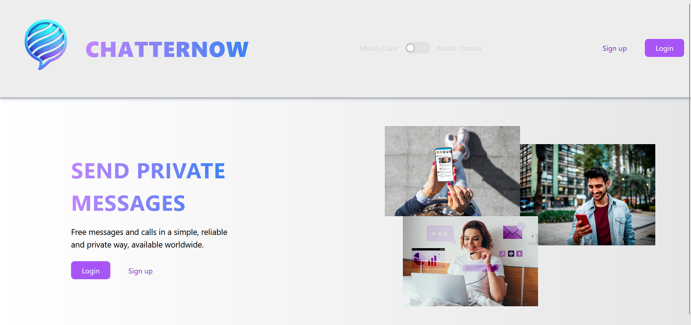

# Echo - Chat App

Echo es una aplicación de mensajería instantánea moderna y eficiente, diseñada para ofrecer una experiencia de comunicación fluida y segura. Inspirada en plataformas populares como WhatsApp, Echo permite a los usuarios enviar y recibir mensajes en tiempo real, compartir archivos multimedia y participar en chats privados.

Construida con Angular para una interfaz rápida y responsiva, y Supabase como backend robusto y escalable, Echo garantiza una gestión de datos confiable y una sincronización eficiente de mensajes. La integración con Supabase Realtime permite que las conversaciones sean actualizadas instantáneamente sin necesidad de recargar la página. Además, gracias a TailwindCSS, la aplicación presenta un diseño atractivo, moderno y adaptable a cualquier dispositivo.

Esta plataforma está enfocada en la seguridad y privacidad de los usuarios, implementando reglas de acceso mediante Row Level Security (RLS) para garantizar que cada usuario solo tenga acceso a sus propias conversaciones. Ya sea para comunicación personal o en el entorno empresarial, Echo es una solución confiable, escalable y fácil de usar.

## Características

✅ Autenticación con Supabase.
✅ Envío y recepción de mensajes en tiempo real.
✅ Almacenamiento de imágenes. 
✅ Chats privados.

## Visualización de interfaces 

### Pantalla de Inicio (Modo Claro)  
  
*Interfaz de la pantalla de inicio de Echo en modo claro, con un diseño limpio y moderno que facilita la navegación.*  

### Pantalla de Inicio (Modo Oscuro)  
  
*La misma pantalla de inicio de Echo pero en modo oscuro, ofreciendo una experiencia visual cómoda para entornos con poca luz.*  

### Pantalla de Registro (Modo Claro)  
  
*Interfaz de registro en modo claro, con un diseño sencillo y optimizado para facilitar la creación de cuentas.*  

### Pantalla de Registro (Modo Oscuro)  
  
*Modo oscuro de la pantalla de registro, manteniendo una estética atractiva y funcional para los nuevos usuarios.*  

### Pantalla de Inicio de Sesión (Modo Claro)  
  
*Diseño de la pantalla de inicio de sesión en modo claro, con un enfoque minimalista y accesible.*  

### Pantalla de Inicio de Sesión (Modo Oscuro)  
  
*Versión en modo oscuro de la pantalla de inicio de sesión, ideal para quienes prefieren una interfaz menos brillante.*  

### Pantalla de Bienvenida (Modo Claro)  
  
*Vista inicial de la aplicación en modo claro, con una interfaz intuitiva que invita al usuario a explorar Echo.*  

### Pantalla de Bienvenida (Modo Oscuro)  
  
*Modo oscuro de la pantalla de bienvenida, proporcionando una alternativa elegante y agradable a la vista.*  

## Instalación y Configuración

1. Clonar el repositorio de GitHub:  
   ```sh
   git clone https://github.com/JuanMoreno1902/echo.git
   cd echo
   ```
2. Instalar dependencias:  
   ```sh
   npm install
   ```
3. Configurar credenciales de Supabase en src/app/services/supabase.service.ts, si se quiere conectar una base de datos propia:
   ```ts
   this.supabase = createClient(
        'https://your-supabase-url',
        'your-supabase-key',
        {
            auth: {
            autoRefreshToken: false,
            persistSession: false,
            detectSessionInUrl: false
            }
        }
    );
   ```
4. Ejecutar la aplicación en modo desarrollo:  
   ```sh
   ng serve
   ```
   Luego, abre `http://localhost:4200/` en tu navegador.

## Arquitectura y Tecnologías Utilizadas  

### Tecnologías Implementadas  

**Frontend:**  
&nbsp;&nbsp;&nbsp; *Angular* para una experiencia dinámica y modular.  
&nbsp;&nbsp;&nbsp; *TypeScript* para un código robusto y escalable.  
&nbsp;&nbsp;&nbsp; *TailwindCSS* para una interfaz moderna, responsiva y altamente personalizable.  

**Backend:**  
&nbsp;&nbsp;&nbsp; *Supabase* como backend-as-a-service, proporcionando:  
&nbsp;&nbsp;&nbsp;&nbsp;&nbsp;&nbsp; **PostgreSQL** para almacenamiento estructurado y eficiente.  
&nbsp;&nbsp;&nbsp;&nbsp;&nbsp;&nbsp; **Supabase Auth** para autenticación segura y sencilla.  
&nbsp;&nbsp;&nbsp;&nbsp;&nbsp;&nbsp; **Supabase Realtime** para comunicación en tiempo real sin necesidad de configurar WebSockets manualmente.  

**Despliegue:**  
&nbsp;&nbsp;&nbsp; *Vercel* para un hosting rápido, seguro y optimizado para Angular.  

---

### Arquitectura del Proyecto  

**Autenticación Segura**  
✔ Implementada con *Supabase Auth*, permitiendo inicio de sesión con email/contraseña y proveedores externos.  

**Mensajería en Tiempo Real**  
✔ Los mensajes se almacenan en *Supabase* y se transmiten al instante usando *Supabase Realtime*, garantizando sincronización inmediata entre usuarios.  

**Reglas de Seguridad con RLS (Row Level Security)**  
✔ Solo los usuarios autorizados pueden acceder a sus propios chats gracias a políticas de seguridad basadas en `auth.uid()`.  

**Interfaz Moderna y Adaptable**  
✔ *TailwindCSS* proporciona un diseño limpio, optimizado para experiencia de usuario y accesible en múltiples dispositivos.  

*Con esta combinación de tecnologías, Echo logra ser una aplicación de mensajería ágil, segura y fácil de escalar.*   

## Retos y Soluciones  

### Problema de Conexión con la Base de Datos  

- **Problema:**  
  Se presentaba un error **Unhandled Promise Rejection: Acquiring an exclusive Navigator LockManager lock**, lo que ocasionaba fallos en la comunicación con Supabase y bloqueos inesperados en la autenticación.  

- **Análisis:**  
  Este error surgía debido a la gestión de sesiones en el navegador, donde el `autoRefreshToken` y la persistencia de sesión en `localStorage` generaban conflictos en entornos de múltiples pestañas o dispositivos.  

- **Solución:**  
  Se configuró `Supabase Auth` con los siguientes parámetros para evitar bloqueos y mejorar la estabilidad de conexión:  
  ```ts
  auth: {
    autoRefreshToken: false, // Evita la actualización automática del token
    persistSession: false,   // Desactiva el almacenamiento de sesión en localStorage
    detectSessionInUrl: false // Previene problemas con OAuth y autenticación en la URL
  }


### Seguridad con Row Level Security (RLS)
- **Problema:** Se requería restringir el acceso a los mensajes para que solo los usuarios autorizados pudieran leer sus propios chats.
- **Análisis:** Sin medidas de seguridad adecuadas, cualquier usuario con acceso a la base de datos podría visualizar mensajes de otros. Era necesario un control de acceso basado en identidad.
- **Solución:** Sin medidas de seguridad adecuadas, cualquier usuario con acceso a la base de datos podría visualizar mensajes de otros. Era necesario un control de acceso basado en identidad.


### Sincronización en Tiempo Real

- **Problema:** La actualización del chat no era instantánea, lo que provocaba retrasos en la visualización de mensajes enviados y recibidos.
- **Análisis:** Sin una suscripción en tiempo real, el usuario debía recargar la página o realizar peticiones manuales para obtener nuevos mensajes.
- **Solución:** Uso de Supabase Realtime con suscripciones a cambios en la base de datos.  

## Contribuciones

Si quieres contribuir, ¡eres bienvenido! Solo haz un fork del repositorio y envía un pull request.

---
*Contribuciones y sugerencias son bienvenidas.*  


